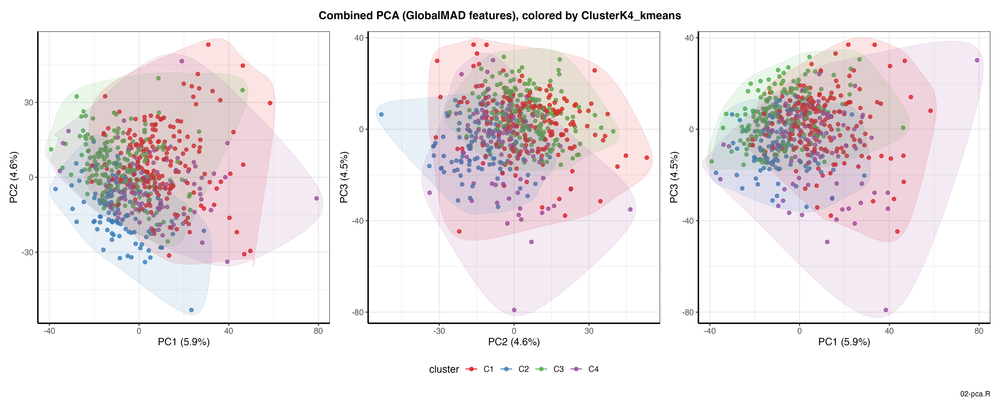
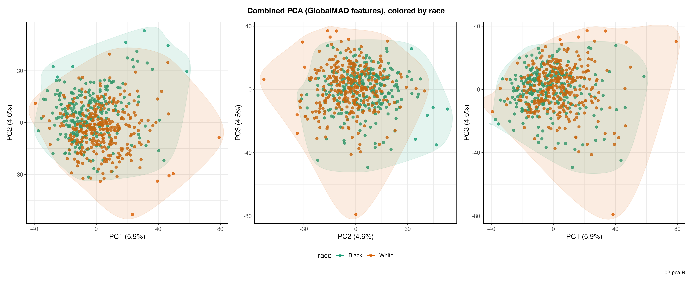
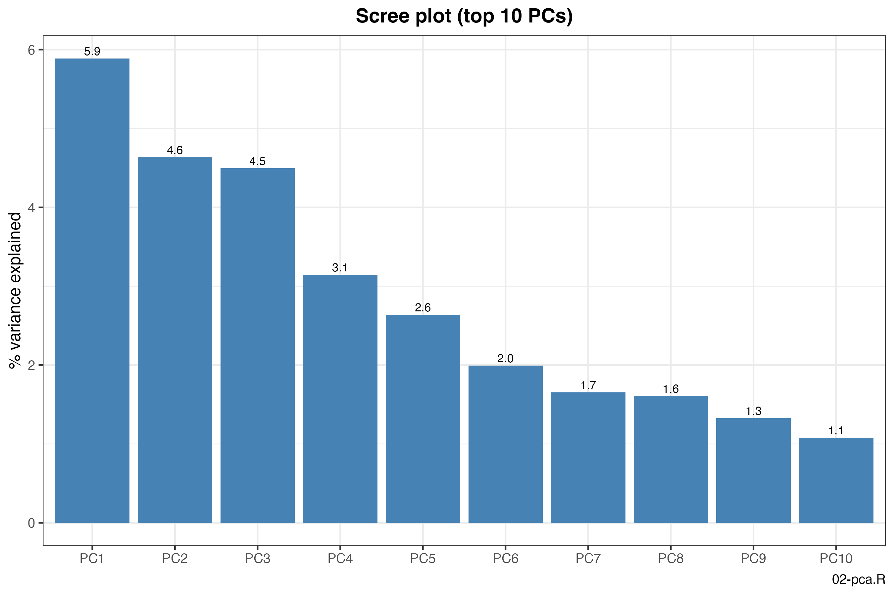
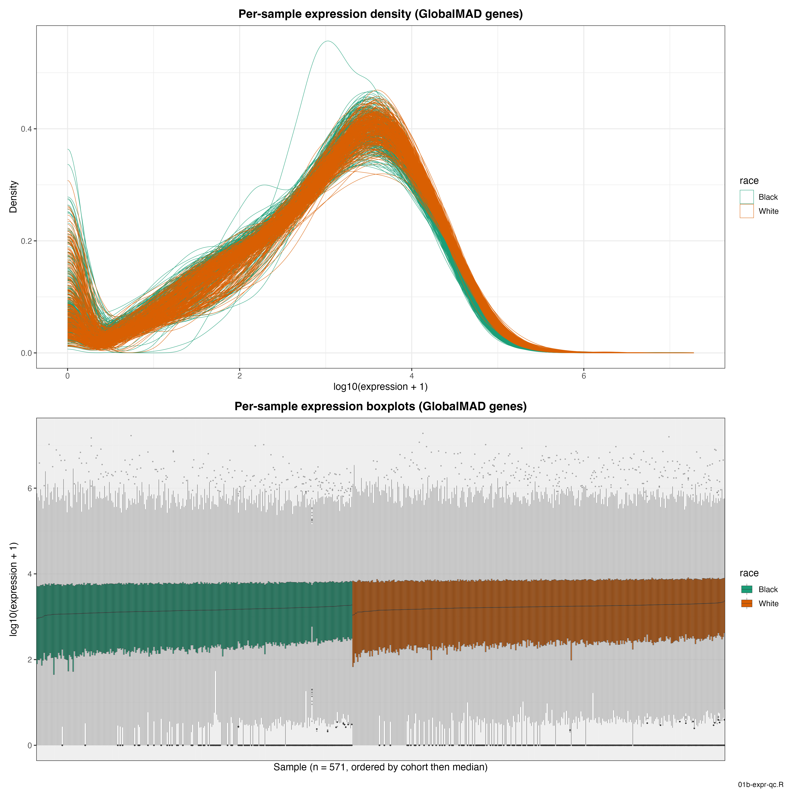
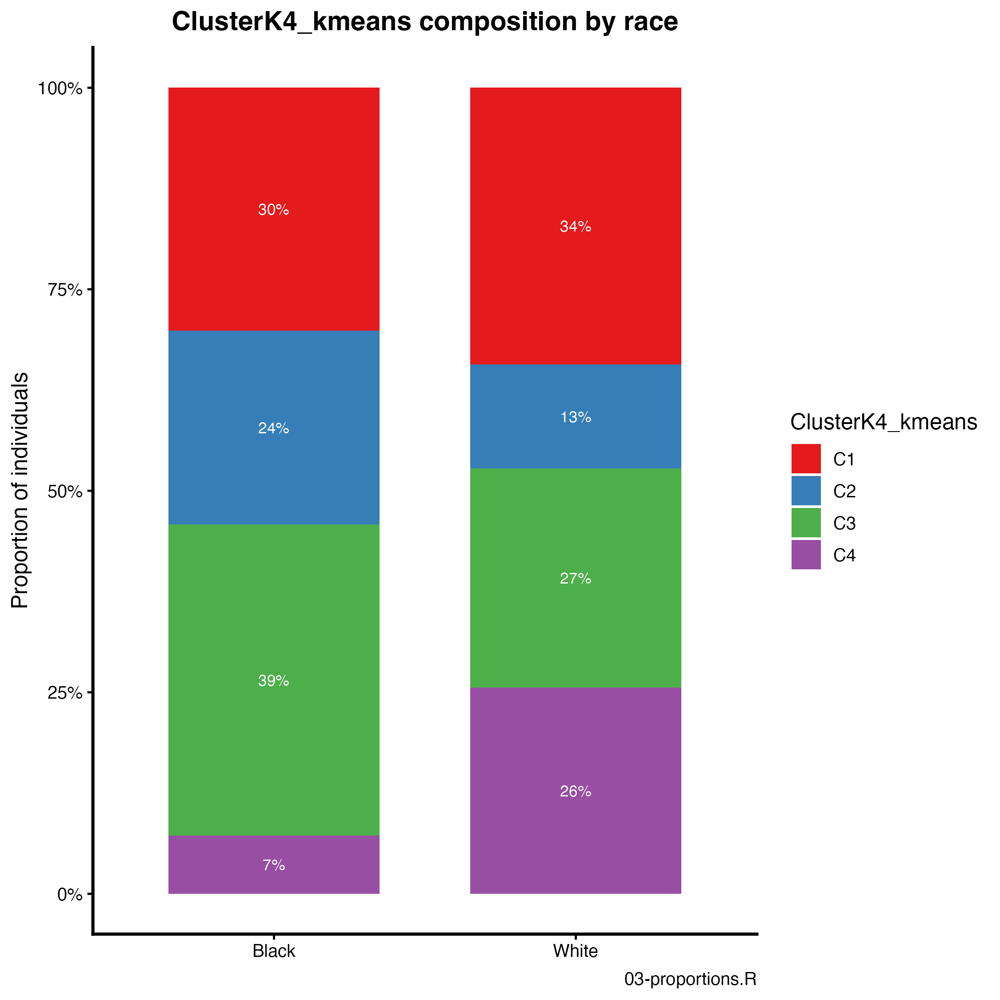
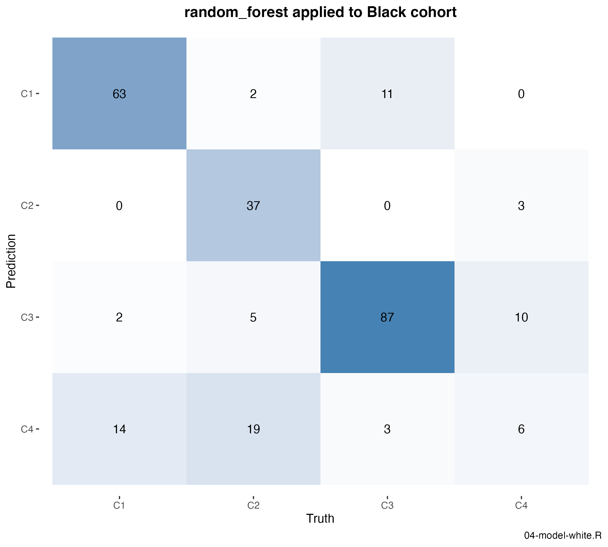
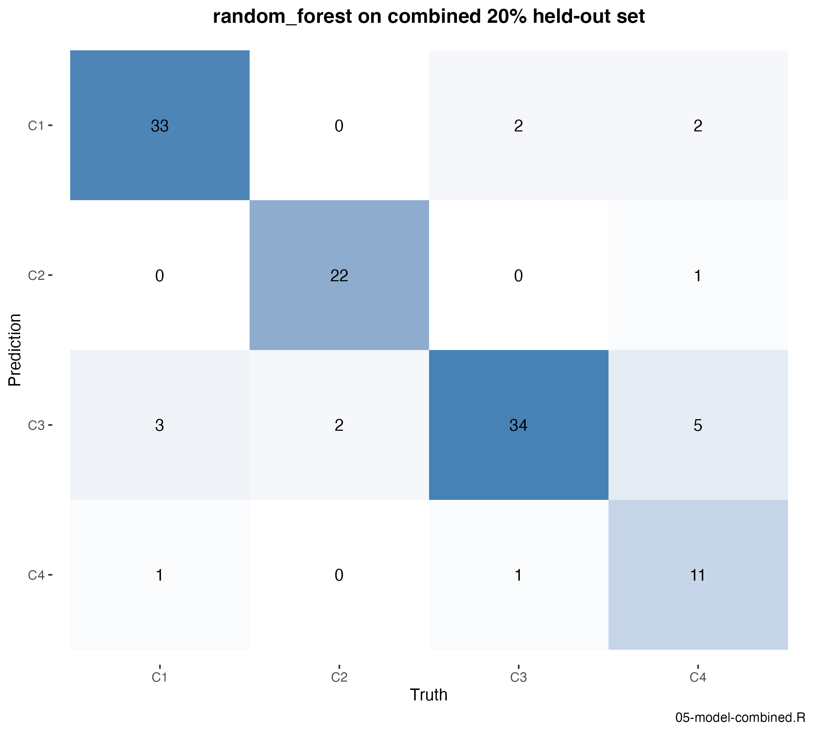
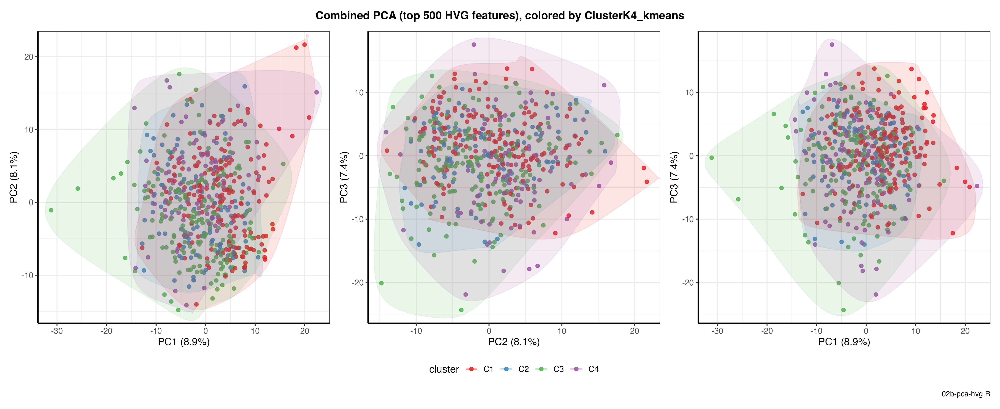
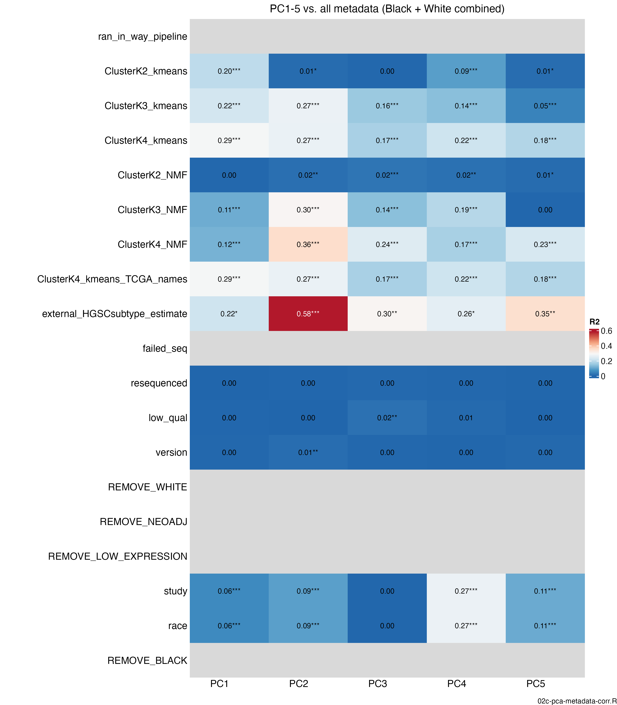

<!--
This document does not execute any R code -- it only links/embeds figures and
tables that were already produced by the scripts in `src/` (run via
`Rscript src/run_all.R` from the project root, plus a couple of standalone
diagnostic scripts noted inline). Every number below was copied from the
corresponding CSV in `../results/`; every image is a plain markdown image link
to a file in `../results/`, not a knitr chunk.
-->

This summarizes the 9 exercise questions from `Instructions.docx`. Source
script for each section is noted in its heading. All figures/tables are in
`../results/`; nothing in this document was (re-)computed.

---

## Q1 — Filter to the GlobalMAD gene list (`src/01-explore.R`)

**How many genes and samples before vs. after filtering to
`supp_table_1_GlobalMAD_genelist.csv`?**

| Cohort | Genes before | Genes after | Samples (unchanged) |
|--------|-------------:|------------:|---------------------:|
| Black  | 18,641       | 4,355       | 272                  |
| White  | 18,851       | 4,355       | 316                  |

Filtering subsets **rows (genes)**, not **columns (samples)** — sample counts
are identical before and after. All 4,355 GlobalMAD genes are present in both
expression tables, so the filter keeps the full list in each cohort.

---

## Q2 — Gene-list overlap (`src/01-explore.R`)

**How many genes are shared between GlobalMAD and CommonGenes?**

- GlobalMAD: **4,355** genes
- CommonGenes: **8,360** genes
- Shared: **4,355** (100% of GlobalMAD)

Every GlobalMAD gene is also in CommonGenes (GlobalMAD ⊂ CommonGenes). This
matches how the two lists are built: CommonGenes are genes reliably measured
across platforms/cohorts, and GlobalMAD is the highest-variance subset of
those — a stricter feature set nested inside CommonGenes.

---

## Q3 — Combined PCA plots (`src/02-pca.R`)

PCA on the combined Black + White expression matrix, restricted to the 4,355
GlobalMAD genes, on `ran_in_way_pipeline == TRUE` samples. Genes are centered
and scaled to unit variance before `prcomp()`.

**Colored by `ClusterK4_kmeans`:**

**Colored by race:**

---

## Q4 — Proportion of variability explained by PC1–PC3 (`src/02-pca.R`)

| PC  | % variance explained |
|-----|----------------------:|
| PC1 | 5.9%  |
| PC2 | 4.6%  |
| PC3 | 4.5%  |
| PC4 | 3.1%  |
| PC5 | 2.6%  |

Full table: `../results/02-pca_variance.csv`. Scree plot (top 10 PCs):

---

## Q5 — Interpretation of the PCA plots, and other data-cleaning steps (written)

### Interpretation

- **Variance is highly diffuse — no single dominant axis.** The top PC
  explains only ~6%, and the next several taper off gently rather than
  showing a sharp elbow. This is the expected signature of a MAD-selected
  high-variance gene set: MAD ranks genes by their own (univariate)
  dispersion, with no regard for whether they co-vary, so the selected genes
  pool markers from several weakly-correlated biological programs
  (proliferation, immune infiltration, stromal content, hypoxia, etc.) plus
  some technical noise. No single program dominates the *total* variance, so
  it spreads across many components instead of concentrating in PC1. This
  pattern is also well documented for HGSC specifically — recent work argues
  HGSC transcriptomic subtypes are largely driven by tumor cellular
  *composition* (a continuous stromal/immune mixture) rather than one
  intrinsic malignant program, which produces exactly this kind of diffuse,
  softly-overlapping structure instead of a crisp discrete split.
- **Race is not a major axis on PC1–PC3.** In `02-pca_by_race.png` the Black
  and White convex hulls overlap almost completely on all three PC pairs. A
  follow-up diagnostic (`src/02c-pca-metadata-corr.R`, see appendix) fits
  `PC ~ factor(covariate)` for every metadata column against PC1–PC5 and
  confirms this quantitatively: `race` and `study` are the same partition of
  samples here (see the batch/cohort caveat below), and that variable
  explains only R²=0.06–0.09 on PC1/PC2, concentrated instead on **PC4**
  (R²=0.27, p≈2×10⁻⁴⁰) — a real association, but not one that dominates the
  leading components.
- **No dominant technical batch effect.** The same PC-vs-metadata check found
  `version` (pilot vs. full-run sequencing batch), `resequenced`, and
  `low_qual` all at R²≤0.02 across PC1–PC5, mostly non-significant —
  reassuring given the diffuse-variance point above.

### Other data-cleaning / validation steps

1. **Library-size / normalization consistency — checked**
   (`src/01b-expr-qc.R`, below). Per-sample expression distributions match
   closely between cohorts.
2. **Outlier samples.** One Black-cohort sample stood out in the density plot
   below (unusually tall, narrow curve); cross-check it against `low_qual` /
   `resequenced` / library size before trusting it in modeling.
3. **Duplicate / re-sequenced samples.** The `resequenced` column suggests
   some individuals appear more than once; make sure the same individual
   never lands in both train and test.

**Supporting diagnostic — per-sample expression QC** (`src/01b-expr-qc.R`):

---

## Q6 — Do subtype proportions differ by race? (`src/03-proportions.R`)

| Cluster | Black | White |
|---------|------:|------:|
| C1      | 30.2% | 34.3% |
| C2      | 24.0% | 12.9% |
| C3      | 38.5% | 27.2% |
| C4      | 7.3%  | 25.6% |

C2 is nearly twice as common in Black individuals; C4 is over three times more common in
White individuals.

**Why this matters for modeling:** the classes are imbalanced overall *and*
imbalanced *differently* by race, so (a) CV folds should be stratified by
subtype to stay representative, and (b) the Q9 combined-cohort split should
stratify on **race × subtype jointly** — stratifying on subtype alone could
still end up race-imbalanced given this dependence.

---

## Q7 — Supervised model on the White cohort (`src/04-model-white.R`)

**Result: random forest wins** (CV ROC AUC 0.978 vs. elastic net's 0.960 —
`mtry = 20`, `min_n = 10`) and is the model carried forward to Q8/Q9. Worth
noting the tradeoff this selection rule quietly makes: picking by CV ROC AUC
alone hands the win to the *less interpretable* model for a ~0.018 AUC gain —
if the deliverable were "which genes drive each subtype" rather than "best
predictive performance," elastic net's interpretable coefficients would be
the better choice despite the lower AUC.

**Feature set:** the 4,355 shared GlobalMAD genes (keeps the model directly
applicable to the Black cohort in Q8).

**Cross-validation:** 5-fold, stratified by `cluster` (Q6 shows the subtypes
are imbalanced, so stratification keeps each fold representative).

**Performance — White, 5-fold CV** (`../results/04-cv_metrics.csv`,
`../results/04-eval_metrics.csv`, chosen model = random forest):

| Metric | Value |
|---|---:|
| ROC AUC (Hand–Till) | 0.978 |
| Balanced accuracy | 0.864 |
| Accuracy | 0.829 |
| Cohen's kappa | 0.760 |
| Macro F1 | 0.810 |

Balanced accuracy/kappa/F1 are the metrics to trust here over raw accuracy,
since Q6 already shows the four subtypes are imbalanced.

---

## Q8 — Apply the White model to the Black cohort, no retraining (`src/04-model-white.R`)

The same fitted random-forest model from Q7 (no retraining) is applied to all
262 eligible Black samples.

**Performance — Black, external apply** (`../results/04-eval_metrics.csv`):

| Metric | Value | vs. White CV |
|---|---:|---:|
| ROC AUC (Hand–Till) | 0.883 | −0.095 |
| Balanced accuracy | 0.778 | −0.086 |
| Accuracy | 0.737 | −0.092 |
| Cohen's kappa | 0.630 | −0.130 |
| Macro F1 | 0.644 | −0.166 |

**Confusion matrix (rows = predicted, cols = true):** per-class recall is
strong for C1 (79.7%), C2 (58.7%), and C3 (86.1%), but **C4 recall is only
31.6%** (6 of 19 true C4 Black samples correctly identified) — and **C4
precision is worse still, at just 14.3%** (6 of 42 samples predicted C4 are
actually C4): the model over-predicts C4, and most of that over-prediction is
really true C2 (19 of the 42) or true C1 (14 of the 42) samples being mislabeled.
This lines up with the Q6 finding that subtype prevalence flips direction
between cohorts — C4 is common in White training (25.6%) but rare in Black
(7.3%), while C2 is the reverse (12.9% White vs. 24.0% Black) — so the model
learned a C4 decision boundary calibrated to White-cohort base rates that
doesn't transfer, and ends up cannibalizing the (Black-cohort-common) C2 class.

**Confirmed pattern:** performance is lower across every metric than the
White CV numbers — a distribution-shift problem (the model learned the White
cohort's expression scale/subtype boundaries; Black was sequenced separately)
compounded by the Q6 finding that class proportions differ by race.

---

## Q9 — Combined model, 20% held out (`src/05-model-combined.R`)

Train on **all** individuals (Black + White), holding out **20%** for final
evaluation. Both the CV folds and the held-out split are stratified on
**race × subtype jointly** (per the Q6 rationale).

Same two candidates and selection rule as Q7 (elastic net vs. random forest,
same shared recipe, same CV-ROC-AUC selection — see Q7 for the full
reasoning). Chosen model again: **random forest** (CV ROC AUC 0.961 vs.
elastic net's 0.945; same hyperparameters as Q7, `mtry = 20`, `min_n = 10`) —
consistent winner across both the White-only and combined training sets, so
this isn't an artifact of one particular training set.

**Performance — combined 20% held-out set** (`../results/05-heldout_metrics.csv`):

| Metric | Overall | Black held-out | White held-out |
|---|---:|---:|---:|
| ROC AUC (Hand–Till) | 0.960 | 0.924 | 0.960 |
| Balanced accuracy | 0.888 | 0.893 | 0.878 |
| Accuracy | 0.855 | 0.906 | 0.813 |
| Cohen's kappa | 0.799 | 0.862 | 0.743 |
| Macro F1 | 0.839 | 0.801 | 0.816 |

**Why this classifier does better/worse than Q7–Q8:**

- **vs. Q8 (out-of-cohort application) — confirmed better.** Black
  performance jumps substantially once Black samples are part of training:
  balanced accuracy 0.778 → **0.893** (+0.115), kappa 0.630 → **0.862**
  (+0.232), ROC AUC 0.883 → **0.924**. This is no longer a cross-cohort
  transfer problem — the model has actually seen Black-cohort technical and
  biological variation during training, including enough real C4 examples
  (rare in White, common enough in Black) to fix the Q8 failure mode.
- **vs. Q7 (White-only CV) — close, not a strict win, and that's the point.**
  White-held-out balanced accuracy (0.878) is essentially the same as the
  White-only CV number (0.864) — pooling in Black data didn't cost White
  performance. Overall ROC AUC (0.960) is only marginally below the
  White-only CV's 0.978. So the pooled model is *not* meaningfully worse for
  White and is *dramatically* better for Black — the right comparison isn't
  "which single number is highest" but "which model performs acceptably on
  **both** populations," and only the combined model does.
- **Caveat.** Pooling helps mainly by absorbing the cohort/batch effect into
  training rather than removing it. The methodologically cleaner path is
  batch-correcting expression first (Q5, cleaning step #1) so subtype signal
  is separated from cohort/ancestry before modeling.

---

## Appendix — additional diagnostics (not part of the graded questions)

These were exploratory follow-ups run during analysis, not requested by the
instructions, kept here for reference:

- **`src/02b-pca-hvg.R`** — same combined PCA, but using the top 500
  most-variable genes (computed on this cohort) instead of GlobalMAD, as a
  robustness check on the feature-selection choice.
  
- **`src/02c-pca-metadata-corr.R`** — PC1–PC5 vs. every available metadata
  column (R² from `lm(PC ~ factor(covariate))`), used to quantify the
  batch-effect and race claims in Q5.
  
